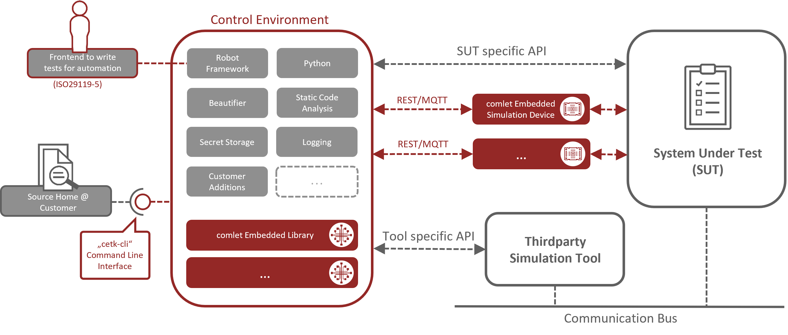

---
hide:
  - navigation
  - toc
---

# Overview

comlet's Embedded TestKit (cETK) is a platform independent (embedded) [test automation solution](https://glossary.istqb.org/en_US/term/test-automation-solution){target="_blank"} and [Robotic Process Automation](https://en.wikipedia.org/wiki/Robotic_process_automation){target="_blank"} (RPA) environment which consists of the following parts:

Main emphasis of test automation with Embedded TestKit (but not limited to) is black-box and end-to-end testing.

The architecture of Embedded TestKit inherits from the generic Test Automation Architecture (gTAA) as [described by ISTQB(tm) in their Advanced Level Syllabus for Test Automation Engineer](http://istqb.org/?sdm_process_download=1&download_id=3435){target="_blank"}.

=== "Key Concepts"
    * [Control Environment](control_env/index.md)
        * [Robot Framework](https://robotframework.org/){target="_blank"} as Test Automation Framework
        * [Python](https://www.python.org/){target="_blank"}
        * [Tidy](https://github.com/MarketSquare/robotframework-tidy){target="_blank"} as test source beautifier
        * [KeePass Library](https://github.com/loomanw/robotframework-keepasslibrary){target="_blank"} for managing secrets
        * [Robocop](https://github.com/MarketSquare/robotframework-robocop){target="_blank"} for static (test) source code analysis
        * Optional
            * Thirdparty/external technology/device driver libraries
            * [comlet Embedded Libraries (cEL)](cel/index.md)
      * [Source Home @ Home Folder](home_folder/source_home.md)
      * [Command Line Interface "cetk-cli"](cli/index.md)
      * [comlet Embedded Simulation Devices (cESD)](cesd/index.md)
      * [Frontend to define test cases according to ISO29119-5](https://robotframework.org/robotframework/7.0/RobotFrameworkUserGuide.html#creating-test-cases){target="_blank"} (provided by Robot Framework)

=== "Key Features"
    * Embedded Ready via cESD
    * Keyword-Driven (ISO29119-5)
    * Test-Driven
    * Continuous Testing (by integration with a CI/CD processor)
    * Functional and non-functional testing (ISO25010)
    * Behavior- and Data-Driven

=== "Key Properties"
    * Flexible Environment/Architecture
    * Augmented Requirements
    * Complexity Reduction
