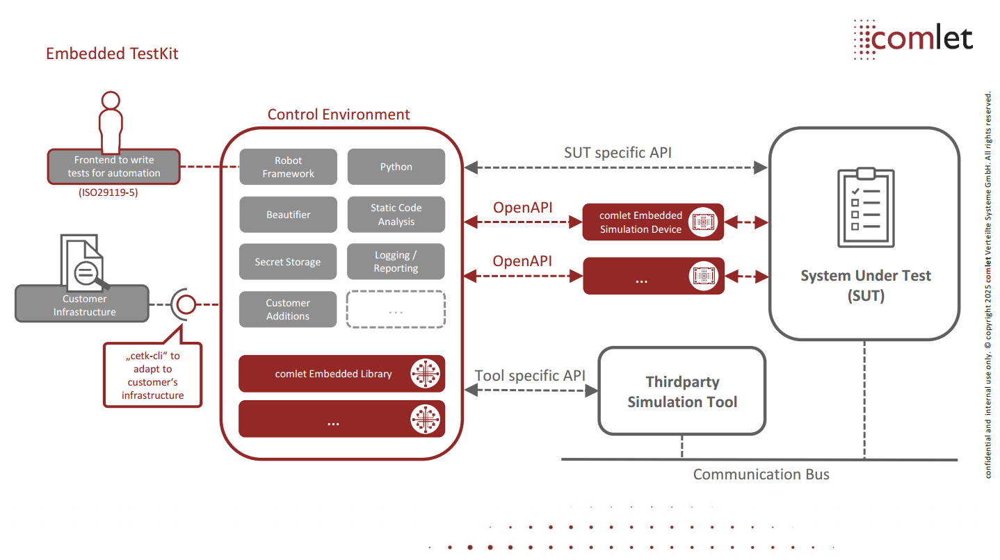

#Overview

comlet's Embedded TestKit is a platform independent (embedded) [test automation solution](https://glossary.istqb.org/en_US/term/test-automation-solution) and [Robotic Process Automation](https://en.wikipedia.org/wiki/Robotic_process_automation) (RPA) environment which consists of the following parts:





* [Control Environment](#control-environment)
  * [Robot Framework](https://robotframework.org/) as Test Automation Framework
  * [Python](https://www.python.org/)
  * [Tidy](https://github.com/MarketSquare/robotframework-tidy) as test source beautifier
  * [KeePass Library](https://github.com/loomanw/robotframework-keepasslibrary) for managing secrets
  * [Robocop](https://github.com/MarketSquare/robotframework-robocop) for static (test) source code analysis
  * Optional (depending on project needs)
    * Thirdparty/external technology/device driver libraries
    * [comlet Embedded Libraries](#comlet-embedded-libraries-cel)
* [comlet Embedded Simulation Devices](#comlet-embedded-simulation-devices-cesd)
* [Frontend to define test cases according to ISO29119-5](https://robotframework.org/robotframework/7.0/RobotFrameworkUserGuide.html#creating-test-cases) (provided by Robot Framework)
* ["cetk-cli"](#how-to-use)

Main emphasis of test automation with Embedded TestKit (but not limited to) is black-box and end-to-end testing.

The architecture of Embedded TestKit inherits from the generic Test Automation Architecture (gTAA) as [described by ISTQB(tm) in their Advanced Level Syllabus for Test Automation Engineer](http://istqb.org/?sdm_process_download=1&download_id=3435).

Key features that can be realized with Embedded TestKit:
* Keyword-Driven (ISO29119-5)
* Test-Driven
* Continuous Testing (by integration with a CI/CD server - e.g, by Jenkins)
* Functional and non-functional testing (ISO25010)
* Behavior- and Data-Driven

Key properties of Embedded TestKit:
* Flexible Environment/Architecture
* Augmented Requirements
* Complexity Reduction

## Control Environment
Embedded TestKit's control environment is a logical entity that either runs encapsulated and self-contained inside a linux Docker container as part of a Docker compose configuration,
or it runs natively on the host platform and assumes all the tools needed are available locally (e.g. installed globally, as Python virtualenv or Conda environment).

In general, all a host needs to execute test cases with Embedded TestKit is:

* Linux, Windows or macOS host platform
  * tested under Ubuntu 20.04 LTS and 22.04 LTS, Debian 11.3.0, Windows 10 and macOS > 12 (Apple silicon)
* Python Version 3.10 or later
* For the Docker configuration
  * Docker engine (e.g. provided by native installation, Docker Desktop or Ranger Desktop)
    * tested with version 20.10.06, 20.10.12, 20.10.17, 25.0.3 and 27.2.0
  * Docker compose v2 cli-plugin (not the stand-alone docker-compose tool)
    * tested with version 2.2.3, 2.6.0, 2.24.5 and 2.29.2
* For the native configuration
  * Locally installed tools (e.g. with the help of a Python virtualenv or Conda environment)

### Environment variables
There are following environment variables available to be utilized inside Embedded TestKit's control environment:
* $TMP which holds the path to a **tmp** folder (only available for Docker configuration)
* $CETK_SOURCE_HOME which holds the path to the (mandatory) **source folder**
* $CETK_SOURCE_HOME_CONTAINER which holds the path to the (mandatory) **source folder** specific to the linux Docker container (only available for Docker configuration)  
* $PYTHONPATH with optional path(s) to Python or Robot Framework libraries

## Robot Framework (RF)
According to gTAA, Robot Framework covers *Test Definition* as well as *Test Execution Layer*.
Definition of test cases can be done **keyword -**, **behavior -** or **data driven**.
There are many [external resources](https://robotframework.org/#resources) ready to be used with RF that cover *Test Adapter Layer*.
For further documentation of RF, feel free to visit [RF's User Guide](http://robotframework.org/robotframework/7.0/RobotFrameworkUserGuide.html).

## Python
Python is the core programming language of Embedded TestKit and together with RF covers *Test Execution Layer*.
It also can be utilized to adapt technologies for test automation on the *Test Adaption Layer*.
Currently, the integrated version and therefor the maximum API to program against is [3.10.x](https://peps.python.org/pep-0619/).
As a style guide, please follow [PEP 8](https://peps.python.org/pep-0008/)

## comlet Embedded Libraries (cEL)
*comlet Embedded Libraries* are pure software libraries developed by comlet to adapt to or simulate embedded technology and protocols needed for test automation, resp. RPA. Those libraries extend the test adaption layer according to gTAA.

## comlet Embedded Simulation Devices (cESD)
In contrast to embedded libraries, *comlet Embedded Simulation Devices* also include custom hardware for simulating embedded technology and protocols needed for test automation, resp. RPA.
Communication between the control environment (test cases) and cESD is done via a unified REST API infrastructure based on [Open API](https://gitlab.comlet.intern/seattle/seattle_cesd_openapi/seattle_cesd_openapi_common).

# How to use
"cetk-cli" is the command-line interface for comlet's Embedded TestKit.

Following parts of the documentation show how to use Embedded TestKit without any given project context (aka "vanilla") from command line.
Most of the time, it's going to be embedded in a real-world project - for example with comlet's own build process.

All given examples are for a host running Linux as operating system and the control environment configured for *docker* (hence a Docker engine must be available).
Nevertheless, the same interface can be used on other platforms, just make sure the correct Python is part of the host's PATH.
The interface has a **-h** (as in help) option which gives further details on usage.

## Installing cetk-cli
The command line interface can be installed as Python wheel by its name "cetk-cli-bin" (e.g. by pip) which will install a platform specific binary version incl.
a default environment definition file, Docker compose configuration and tidy, robocop configurations.

## Configure Control Environment
Configuration is done via the [environment variable definition file](#environment-variable-definition-file) or by defining the following environment variables manually.

**Note:** manually defined environment variables take precedence over those defined in the [Environment Variable Definition File](#environment-variable-definition-file).

* CETK_ENVIRONMENT: [docker|native] - default: native
* CETK_CORE_IMAGE: name of the core image to be used when configured as docker environment

### Environment Variable Definition File
* with **--env-file**, a path can be specified where an optional/project specific *.env* file is loaded from, e.g. from systemtest/.env
* default behavior if **no** --env-file option is given: the internal default *.env* file from the cetk-cli is loaded 
* In general, using a *.env* file is optional unless the control environment is run inside a Docker container [(see Configure Control Environment)](#configure-control-environment)

## Running EXECUTABLEs in general
To execute any allowed EXECUTABLE inside the control environment:
```
cetk ARGUMENT(s) EXECUTABLE ARGUMENT(s)
```

For more information on usage and which EXECUTABLES are allowed to be run inside the control environment, see the **help** option of the interface:
```
cetk --help
```
This command will display all available options and commands, detailing each aspect of cetk-cli's functionality for quick reference.
Every EXECUTABLE also provides a help by an --help option.

**Note:** If used with docker configuration, the core image is downloaded from comlet's paketmanager for the first time and the user agnostic main (one-off) image is built automatically from it.

Default (test) source home folder path that is utilized is the root project folder, e.g.:
  * if the host path of *cetk* is **/home/user/git/repo/**
  * -> (test) sources path becomes **/home/user/git/repo**

### Special path handling of EXECUTABLE's ARGUMENT(s) for Docker configuration
If docker configuration is used, keep in mind that the target platform may be different from the host platform.
Therefore, all paths given as ARGUMENT for an EXECUTABLE must comply to the target platform.

Example: the host platform is Windows and the control environment is configured for Docker (hence the target platform is linux).

```
path\to\cetk robot path/to/test_suite.robot
```

### Using dedicated source home folder as base for EXECUTABLEs
To achieve this, use following options with the *cetk* module (if default path is not sufficient):

```
cetk -s /path/to/sources/on/host EXECUTABLE ARGUMENT(s)
```

* **-s** is the absolute path to the source folder on the host machine (e.g. this repo's folder) that shall be utilized
* working directory for test execution becomes **/path/to/sources/on/host**

### Using optional binary/output folder
It's in general a good idea to separate source and binary/output folder to comply with out-of-source build guidelines.
To achieve this with Embedded TestKit, there's an additional option that can be utilized and that works the same way as **-s** option:

* **-o** is the absolute path to the binary/output folder on the host machine that shall be utilized inside the control environment, if it is not given source home will be used

### Adding additional context/Docker container to be executed
If a (project) specific context for test automation is needed (e.g., additional Docker images need to be started and executed),
additional Docker compose files can be provided with the **-f** option that are merged with the default compose.yaml.
Additionally, already defined properties can be overwritten with this approach.
To learn more about the compose specification, [read on here](https://github.com/compose-spec/compose-spec).

## Test execution (robot)
Test execution is started with the dedicated **robot** EXECUTABLE.

```
cetk robot /path/to/test_suite.robot
```

### Features enabled by default
The following features are enabled by default:

* ```--skiponfailure not_ready```
  * test cases with this tag are executed but their result is ignored (aka skipped) for the overall result
* ```--randomize tests```
  * randomize execution of test cases inside test suites (seed to reproduce can be observed in log)
* ```--removekeywords tag:no_logging```
  * keywords with this tag do not log anything (e.g., because this would log a password)
* ```--exclude dont_run```
  * test cases with this tag are not executed
* ```--xunit output_xunit.xml```
  * Additional report in xunit format to be integrated in CI server like gitlab or jenkins


## Test documentation (testdoc)
Generation of test documentation is started with the dedicated **testdoc** EXECUTABLE.

```
cetk testdoc /path/to/test_suite.robot path/to/testdoc.html
```

### Features enabled by default
The following features are enabled by default:

* ```--exclude dont_run```
  * test cases with this tag will not show up in test documentation

For further documentation of RF's Testdoc, feel free to visit [RF's User Guide for Testdoc chapter](http://robotframework.org/robotframework/7.0/RobotFrameworkUserGuide.html#test-data-documentation-tool-testdoc).

## Test source beautifier (tidy)
Beautifying test sources, i.e. test suites (*.robot) and resource files (*.resource) is started with the dedicated **tidy** EXECUTABLE.

```
cetk tidy /path/to/test_suite.robot
```

A default configuration is part of the cetk-cli but if the default config is not sufficient:

```
cetk tidy --config /path/to/config.toml /path/to/test_suite.robot
```

### Features enabled by default
The following features can be enabled by cli:
* ```--check```
  * Robotidy can return exit code 1 if any file would be transformed

For further documentation of Robotidy, feel free to visit [Robotidy's website](https://robotidy.readthedocs.io/en/4.11.0/).

## Static (test) source code analysis (robocop)
Perform a static (test) source code analysis of test suites (*.robot) and resource files (*.resource) with the dedicated **robocop** EXECUTABLE.

```
cetk robocop /path/to/directory/or/file.robot
```

A default configuration is part of the cetk-cli but if the default config is not sufficient:

```
cetk robocop --config /path/to/config.toml /path/to/directory/or/file.robot
```

### Features enabled by default
Robocop fails if an error or warning rule is broken. All errors and warnings must be fixed - infos are optional but recommended to be looked into as well.
If a rule is disabled, this has to be done as an ultima ratio, only, and the rationale well explained during review.

For further documentation of Robocop, feel free to visit [Robocop's website](https://robocop.readthedocs.io/en/5.0.3/).

## Library documentation (libdoc)
Generation of (keyword) library html documentation is started with the dedicated **libdoc** EXECUTABLE.
Documentation can be created for test libraries (\*.py) or resource files (\*.resource).

```
cetk libdoc /path/to/library.resource /path/to/library.html
```

To use the library documentation tool a certain [syntax](http://robotframework.org/robotframework/7.0/RobotFrameworkUserGuide.html#documentation-syntax) must be followed.

Example syntax for sources:

```
"""Example library in Robot Framework format.

- Formatting with *bold* and _italic_.
- URLs like https://example.com are turned to links.
- Custom links like [https://robotframework.org|Robot Framework] are supported.
- Linking to `My Keyword` works.
"""

def my_keyword():
    """Nothing more to see here."""
```

For further documentation of RF's Libdoc, feel free to visit [RF's User Guide for Libdoc chapter](http://robotframework.org/robotframework/7.0/RobotFrameworkUserGuide.html#library-documentation-tool-libdoc).


## Merging several reports and logs (rebot)
Combining logs and reports (from their source *.xml files) is started with the dedicated **rebot** EXECUTABLE.

This script runs the following tasks:
* Passing all arguments to the execution of RF's Rebot

Example:

```
cetk rebot --outputdir /path/to/combined_output --name some_overall_log_title /path/to/input\*.xml_files
```

### Features enabled by default
The following features are enabled by default which in general save all output artifacts as additional **_combined** variant:

* ```--output output_combined.xml```
* ```--xunit output_xunit_combined.xml```
* ```--report report_combined.html```
* ```--log log_combined.html```

For further documentation of RF's Rebot feel free to visit [RF's User Guide for post-processing output chapter](http://robotframework.org/robotframework/7.0/RobotFrameworkUserGuide.html#post-processing-outputs).

# Saving artefacts
## Store executable results in output home
If output home **-o** option is used, the result from the executables is stored in **path/to/output_home/artefacts/[executable]**.

If output home **-o** option is not used, the result from the executables is stored in **path/to/source_home/artefacts/[executable]**.

In the case the user add the specific executable output option in addition, this will be overriden and the standard folder will be used.

For testdoc the standard artefact name is testdoc.html.

For libdoc the standard artefact name is libdoc.html.
